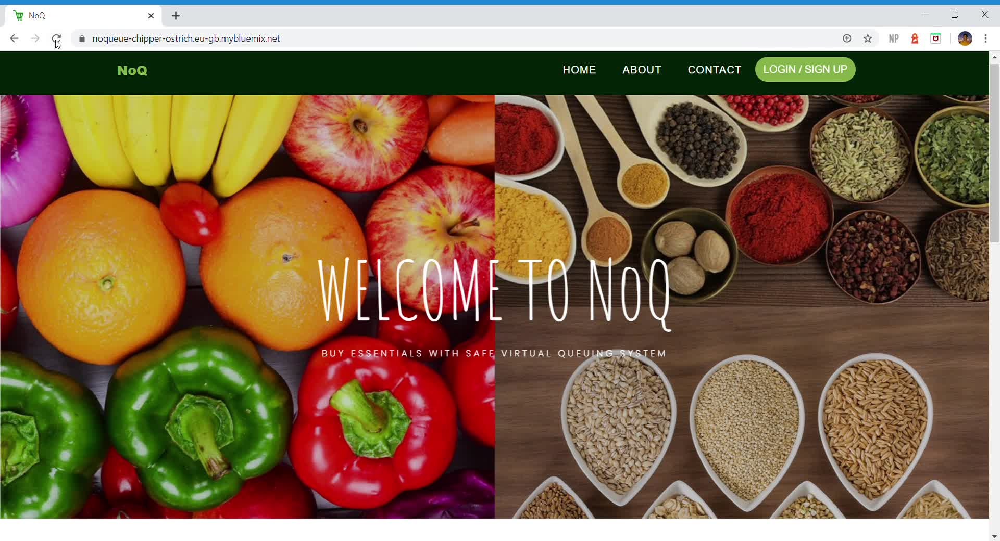

<div align = "center">

</div>
<h1 align="center">NoQ</h1>

<div align="center">

[](https://www.python.org/)

[](https://www.javascript.org/)

<br>

</div>

------------------------------------------

> Buy essentials with safe virtual queuing system 

> Limit the number of customers in the store 

> There's no need to queue outside the store

> Customers can wait in the comfort of their home
-------------------------------------------

##### Demo

<div align = "center">

Home Page
 


Customer Interface


Shopkeeper Interface


Progressive Web App


</div>


------------------------------------------
### Installation and Deployment

Using Python
```
python -m app.py
```

------------------------------------------

### Contributing

 We're are open to `enhancements` & `bug-fixes`


------------------------------------------

### Contributors

* [@tejas2008](https://github.com/tejas2008)
* [@vig2306](https://github.com/vig2306)
* [@debdatta123](https://github.com/debdatta123)
* [@sbangad](https://github.com/sbangad)
* [@mr-boomerrang](https://github.com/mr-boomerrang)


------------------------------------------

This repository / project was a part of IBM hackathon Crack The Covid-19  
